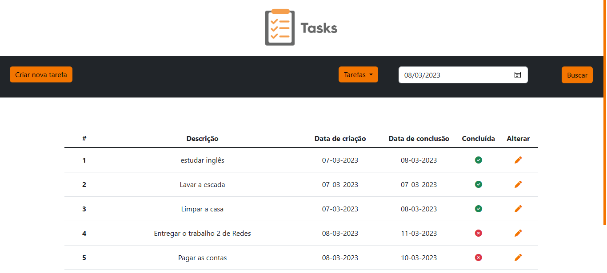
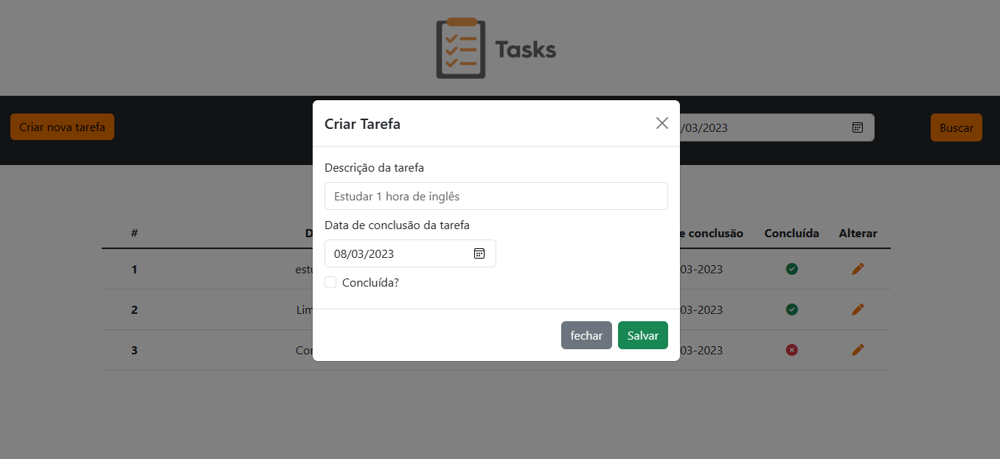
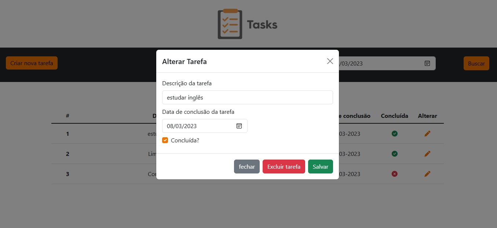

<h1 align="center"> Lista de tarefas </h1>

  

 Projeto desenvolvido com Javascript, NodeJS, Express, Bootstrap, CSS, HTML e Jquery.
 

  <a href="#-sobre-o-projeto">Sobre o projeto</a>&nbsp;&nbsp;&nbsp;|&nbsp;&nbsp;&nbsp; 
  <a href="#-layouts">Layouts</a>&nbsp;&nbsp;&nbsp;|&nbsp;&nbsp;&nbsp;
  <a href="#-requisitos-e-recomendações">Requisitos e recomendações</a>&nbsp;&nbsp;&nbsp;&nbsp;&nbsp;&nbsp;

</img>

# 💻 Sobre o projeto 

O aplicativo de organização de tarefas é um CRUD simples com funcionalidades básicas. O objetivo da aplicação é botar em prática alguns conhecimentos em nodeJS e mongoose adquiridos pelo autor. Também, por meio dele, entender melhor como funciona solicitações assíncronas na WEB e aplicá-las, bem como revisar os conhecimentos em HTML5 CSS3 e DOM do javascript. Como já citado, o usuário pode realizar todas as ações de um CRUD (criar, ler, atualizar e remover) e aplicar alguns filtros para facilitar a gestão. São eles: buscar por data, visualizar tarefas concluídas e visualizar tarefas não concluídas (os últimos dois filtros também se aplicam em função do primeiro, ou seja, se o usuário buscou por data, pode ver somente as tarefas não concluídas se quiser).

  

# 📸 Layouts 

<h3 align="center">Tela principal da aplicação</h3>

</img>

 
<h3 align="center">Filtro por data aplicado</h3>

</img>
 
 
<h3 align="center">Janela de criação de novas tarefas</h3>

</img>
 
 
<h3 align="center">Janela de edição de tarefas</h3>

</img>
 

  

# 📝 Requisitos e recomendações

PARA ACESSAR O PROJETO:
- <a href="https://young-sands-32308.herokuapp.com/">App hospedado no heroku.</a>

OBS:
- A ideia da aplicação foi inspirada em uma outra que foi realizada pelo autor em PHP.

  

# ✒️ Autor

Yves Lima Silva

<a href="https://www.linkedin.com/in/yves-lima-b63b2515b/"> Linkedin </a>
